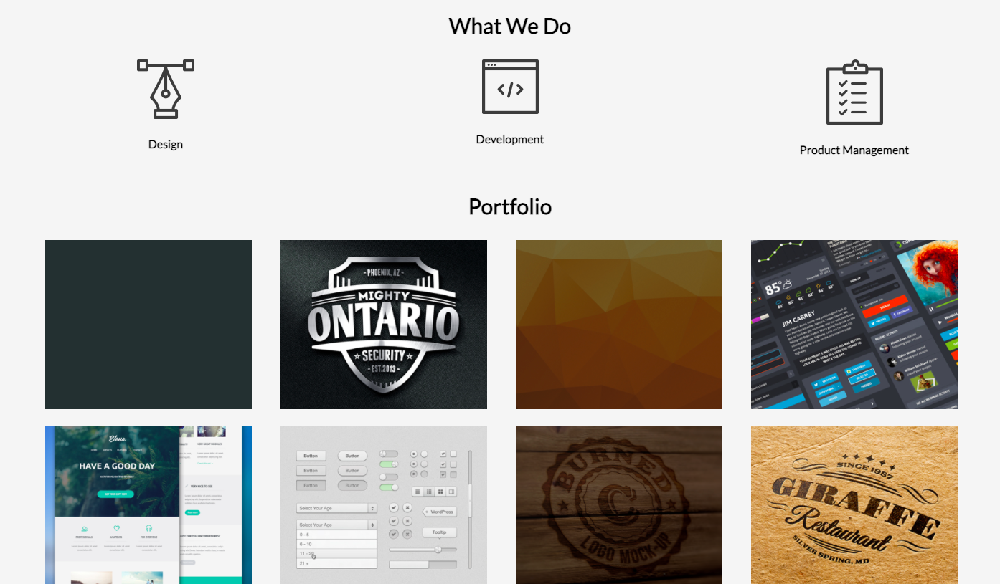

# Delani Studio
#### 14/03/2022
This is a basic html/css portfolio Site for Delani Studio.
#### By 
Geoffrey Gichaga .G

## Table of Content

+ [Description](#description)
+ [Installation Requirement](#Installation)
+ [Known Bugs](#Known-Bugs)
+ [Technology Used](#technology-used)
+ [Support and Contact Details](#Support-and-contact-details)
+ [Authors Info](#authors-Info)

## Description
This is  porfolio site for a company called Delani ,the purpose of the site is to give clients an overview of the company and shocase some of the projects they have worked on

## Desktop mode display:
### LandingPage

### About Us 

### Porfolio 

### Contact Us 

 

## Setup/Installation Requirements
* SIte can be accessed through the repo live link on the About Section
* A phone .tablet or a desktop computer
* Site is responsive to screens of upto 1200px

## Known Bugs
There are no known bugs ,if you spot one please dont hesitate to inform me.
## Technologies Used
Languages used in developing this site include:
* HTML 
* CSS
* Javascript
* JQuery
## Support and contact details
You can report any issue you encounter with the site on [Email](geoffrey.githinji@student.moringaschool.com)

### Copyright (c) {year}
copyright (c) 2022.All rights reserved.

## Authors Info
LinkedIn - [Geoffrey Gichaga .G](https://www.linkedin.com/in/geoffrey-gichaga-234318ba/)

